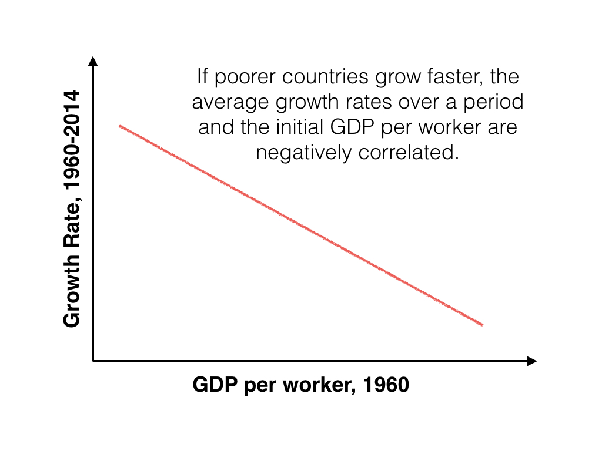

```{r setup, include=FALSE}
knitr::opts_chunk$set(fig.align = 'center')
source("../R/utils.R")
library(tidyverse)
```


## Conditional convergence

Recall the following relationship beteween the growth rates of $K$ and $k$.

$$\frac{\dot K}{K} = \frac{sf(k)}{k} - \delta$$

It holds that

$$\frac{d}{dk} \left(
  \frac{\dot K}{K}
\right) = 
s\left(\frac{kf'(k) - f(k)}{k^2}\right) < 0$$

since, by strict concavity of $f$,

$$f'(k) < \frac{f(k)}{k}, \quad k > 0$$

---

## Conditional convergence (cont'd)

```{r, echo=FALSE}

```


---

`r section("Mankiw, Romer and Weil 1992")`

---

## MRW

In today's class and the next, we study the theory proposed by [Mankiw, Romer and Weil (1992, QJE)](https://doi.org/10.2307/2118477) (henceforth, MRW) 

This paper is extremely influential. Please read it.

---

## Cobb-Douglas production function

We consider the following function form:

$$F(K, L) = K^\alpha L^{1 - \alpha}$$

The intensive-form:

$$f(k) = k^\alpha$$ 

---

## Steady state

Verify that the steady state is given by 

$$k^* = \left(\frac{
  s
}{
  \delta + g + n
}\right)^{\frac{1}{1 - \alpha}}$$

and that output per worker is given by

$$\frac{Y}{L}
=
A \left(\frac{
  s
}{
  \delta + g + n
}\right)^{\frac{\alpha}{1 - \alpha}}$$

---

## Elasticity of output per capita wrt saving rate

$$\ln \left( \frac{Y}{L} \right) =
\log A(0) + gt + \frac{\alpha}{1 - \alpha} \ln (s)
-\frac{\alpha}{1 - \alpha} \ln (\delta + g + n)$$

Data suggests that 

$$\alpha \simeq \frac{1}{3} \Longrightarrow
\frac{\alpha}{1 - \alpha} \simeq \frac{1}{2}$$

The Solow model, therefore, suggests that 1% increase of $s$ implies 
0.5% increase of $Y/L$.

Increment of $\delta + g +n$ by 1% decreases $Y/L$ by 0.5%.


---

## Question

Do data support these predictions of the Solow model
concerning the determinant of standard of living?

---

## Assumptions

MRW assumes the following: 

* $g$ and $\delta$ are constant across countries.
    * advancement of knowledge, which $g$ reflects, is not country-specific
    * no strong reason to expect $\delta$ to vary across countries
* A(0) is decomposed into $A(0) = a + \epsilon_j$, where $a$ is common to 
  all countries and $\epsilon_j$ is country-specific shock.

---

## Empirical specification

Consider $t = 0$.

MRW's first empirical specification:

$$\ln \left( \frac{Y_j}{L_j} \right) =
a + \frac{\alpha}{1 - \alpha} \ln (s_j)
-\frac{\alpha}{1 - \alpha} \ln (\delta + g + n_j) + \epsilon_j$$

Under the assumption that $s$ and $n$ are independent of $\epsilon$
we can estimate the above with the ordinary least squares.

$$\ln \left( \frac{Y_j}{L_j} \right) =
\beta_0 + \beta_s \ln (s_j) +
\beta_n \ln (\delta + g + n_j) + \epsilon_j$$

---

## Empirical specification (cont'd)

$$\ln \left( \frac{Y_j}{L_j} \right) =
\beta_0 + \beta_s \ln (s_j) +
\beta_n \ln (\delta + g + n_j) + \epsilon_j$$

If the Solow model is a good model of the economy, then the 
OLS would predict

$$\beta_s \simeq 0.5$$

$$\beta_n \simeq - 0.5$$


To perform the empirical exercise, we need to determine
$Y_j/L_j$, $s_j$, and $\delta + g + n_j$ from data.

---

## Empirical specification (restricted regression)

Since the model predicts that $\beta_s$ and $\beta_n$ are 
the same in maginitude and opposite in sign, the 
following specification should work.

$$\ln \left( \frac{Y_j}{L_j} \right) =
\beta_0 + \beta_1 \left( 
  \ln (s_j) - \ln (\delta + g + n_j)
\right) + \epsilon_j$$


---

## Data

MRW uses data set constructed by Summers and Heston (1988), an earlier version of 
the Penn World Table that you are already familiar with.

Their dataset convers the period of 1960 to 1985.

---

## Data (cont'd)

They measure 

* $n_j$ as the **average rate of growth of the working-age population**.
  (Unlike PWT v9.0, the earlier version does not contain total number of the 
  employed.)
* $s_j$ as the average share of real private and public investment. (**average 
  share of gross capital formation**)
* $Y_j/L_j$ as **real GDP devided by the working-age population** in 1985.
  (1985 is the latest sample in their dataset.)

They simply assume that $\delta + g = 0.05$.

---

## Non-oil, Intermediate, OECD

They used three sample for the empirical study.

* Non-oil countries exclude countries that are heavily reliant on oil production.
* Intermediate countries exclude countries whose population in 1960 is less than 1 million.
* OECD countries consist of OECD countries with populations greater than 1 million.


.small[
According to a recent data by World Bank, Venezuela and Chad are more heavily reliant 
on oil than Iran but MRW includes those two countries while excluding Iran. 
]


---

Table 1 on p. 414 (emphasis added)

```{r, echo=FALSE, out.width="600px"}
knitr::include_graphics("images/mrw_table1.png")
```

---

## Implied $\alpha$

The restricted regression predicts higher $\alpha \simeq 0.59$ from 
the coefficient on ln(I/GDP);

$$\frac{\alpha}{1- \alpha} \simeq 1.43$$

implies

$$\alpha \simeq 0.588..$$

which is much higher than the common wisdom $\alpha \simeq 1/3$.

---

## Exercise (A part of the mid-term)

Do the above two regression analyses 

* non-restricted, bivariate OLS
* restricted, simple OLS

with PWT v9.0 dataset with 

* countries the populations of which in 1960 are more than 1 million,

Report on what you observe.

---

## What's wrong?

MRW's strategy to fix the bad prediction: 

**Add human capital to the Solow model**

---

## Production function

Let $0 < \alpha + \beta < 1$, $\alpha, \beta > 1$. The output is given by

$$Y = K^\alpha H^\beta (AL)^{1 - \alpha - \beta}$$

* $H =$ stock of human capital
* $K =$ stock of physical capital
* $A =$ knoledge
* $L =$ labor

$$\begin{aligned}
  k = \frac{K}{AL},\quad
  h = \frac{H}{AL},\quad
  y = \frac{Y}{AL} = k^\alpha h^\beta
\end{aligned}$$

---

## Investment

They assume that the constant investment rate for both capitals.

* $s_k =$ saving rate for physical capital
* $s_h =$ saving rate for physical capital


Verify that 

$$\begin{aligned}
  \dot k &= s_k y - (\delta + g + n) k\\
  \dot h &= s_h y - (\delta + g + n) h
\end{aligned}$$

---

## Takeaway

Compute the steady state

$$k^* \quad \text{and} \quad h^*$$

and verify that 

$$\begin{multline}
  \ln \left( \frac{Y}{L} \right) =
  \log A(0) + gt + 
  \frac{\alpha}{1 - \alpha - \beta} \ln (s_k) \\ + 
  \frac{\beta}{1 - \alpha - \beta} \ln (s_h) - 
  \frac{\alpha + \beta}{1 - \alpha - \beta} \ln (\delta + g + n)
\end{multline}$$


