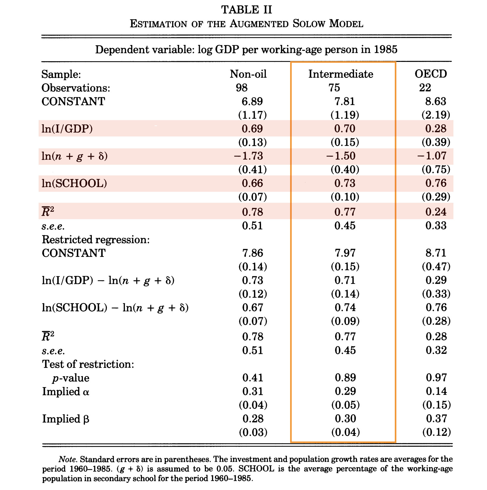

```{r setup, include=FALSE}
knitr::opts_chunk$set(fig.align = 'center')
source("../R/utils.R")
library(tidyverse)
```


`r section("Augmented Solow model")`

---

## Production function

Let $0 < \alpha + \beta < 1$, $\alpha, \beta > 1$. The output is given by

$$Y = K^\alpha H^\beta (AL)^{1 - \alpha - \beta}$$

* $H =$ stock of human capital
* $K =$ stock of physical capital
* $A =$ knowledge
* $L =$ labor

$$\begin{aligned}
  k = \frac{K}{AL},\quad
  h = \frac{H}{AL},\quad
  y = \frac{Y}{AL} = k^\alpha h^\beta
\end{aligned}$$

---

## Investment

They assume that the constant investment rate for both capitals.

* $s_k =$ saving rate for physical capital
* $s_h =$ saving rate for human capital


Verify that 

$$\begin{aligned}
  \dot k &= s_k y - (\delta + g + n) k\\
  \dot h &= s_h y - (\delta + g + n) h
\end{aligned}$$

---

## Steady state

Compute the steady state

$$k^* \quad \text{and} \quad h^*$$

and verify that 

$$\begin{aligned}
h^{*} &=\left(\frac{s_{k}^{\alpha}s_{h}^{1-\alpha}}{\delta+g+n}\right)^{\frac{1}{1-\alpha-\beta}}\\
k^{*}&=\left(\frac{s_{k}^{1-\beta}s_{h}^{\beta}}{\delta+g+n}\right)^{\frac{1}{1-\alpha-\beta}}.
\end{aligned}$$

---

## Model 1: Decomposition of Y/L, Eq. (11)

$$\begin{multline}
  \ln \left( \frac{Y}{L} \right) =
  \log A(0) + gt + 
  \frac{\alpha}{1 - \alpha - \beta} \ln (s_k) \\ + 
  \frac{\beta}{1 - \alpha - \beta} \ln (s_h) - 
  \frac{\alpha + \beta}{1 - \alpha - \beta} \ln (\delta + g + n)
\end{multline}$$

* The coefficient, $\alpha / (1-\alpha-\beta)$ on $\ln (s_k)$ is greater 
  than $\alpha / (1 - \alpha)$ because $1 - \alpha > \beta > 0$
* The coefficient on $\ln (\delta + g + n)$ is larger in absolute value 
  than the coefficient on $\ln (s_k)$ i.e.,
  $$\frac{\alpha}{1 - \alpha - \beta} < \frac{\alpha + \beta}{1 - \alpha - \beta}$$
  

---

## Model 2: Another decomposition, Eq. (12) 

$$\begin{multline}
  \ln\left(\frac{Y}{L}\right) = 
  \ln A(0)+gt+\frac{\alpha}{1-\alpha}\ln(s_{k}) \\ -
  \frac{\alpha}{1-\alpha}\ln(\delta+g+n)+\frac{\beta}{1-\alpha}\ln(h^{*})
\end{multline}$$

This specification is almost identical to the equation we used in the last session.

By omitting $\ln(h^{*})$ term, the previous linear regression 
is subject to omitted-variable bias because $h^*$ may be 

* positively correlated with $s_k$
* negatively with $n$

---

## Model Choice made by MRW

Which of $s_h$ and $h^*$ is easier to measure?

As a proxy for $s_h$, MRW measured the percentage of the working-age population 
that is in secondary school. 

$$\begin{multline}
\texttt{SCHOOL} =
\frac{\text{# of people in secondary school}}{\text{# of people aged 12-17}}\\
\times
\frac{\text{school age population (15-19)}}{\text{working age population}}
\end{multline}$$

Then they used this variable to test Model 1. 


---


```{r, echo=FALSE, out.width="600px"}

```

---

## Coefficients


$$\begin{aligned}
  \frac{\alpha}{1 - \alpha - \beta} 
    &\simeq 0.70\\
  \frac{\beta}{1 - \alpha - \beta}
    &\simeq 0.73\\
  \frac{\alpha + \beta}{1 - \alpha - \beta}
    &\simeq -1.50
\end{aligned}$$

These estimates suggest

$$\alpha \simeq 0.3 \quad \text{and}\quad \beta \simeq 0.3$$

Consistent with the common wisdom.


---

`r section("Preliminary for the next step")`

---

## Question

Suppose that you have just heard that your tax you had already paid 
(say, 10,000 Yen) will be reimbursed next month.

What would you do with the expected windfall gains?

1. Nothing. Wait until you have the cash.
2. Go shopping or go for a drink this weekend, expecting the refund. 


---


## Why Solow not enough?

In the Solow model, **the saving rate is exogenous**. Take a tax reduction 
for example. In the Solow model, consumers raises consumption at the time 
of enforcement of the new tax system.

But usually governments would inform the change of tax well before the enforcement and we might drink a toast to the tax reduction.

Similarly, in case of tax hike, it is possible that consumers consume
more immediately after knowing that they will have to pay more to the
government.

---

## Why Solow not enough? (Cont'd)

So, the Solow model is missing an important aspect of our economic activity: **Expectation formation**.

Although rigorously dealing with the problem of expectations is beyond the scope of this 
course, the **Ramsey model** will serve as the skeleton of more elaborate models.


