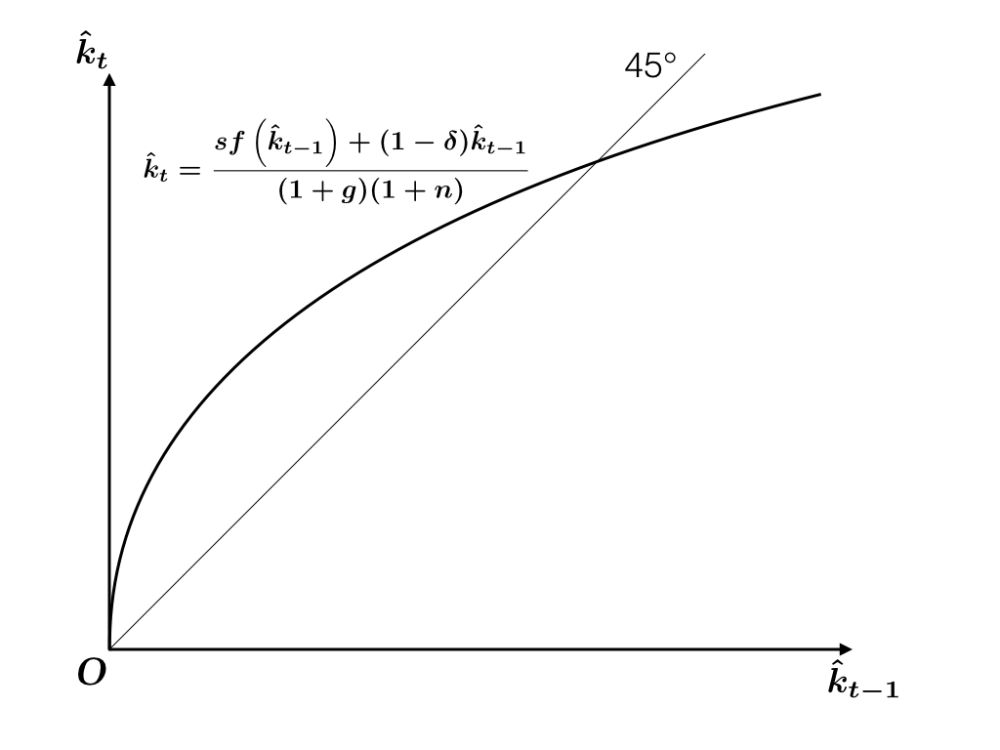
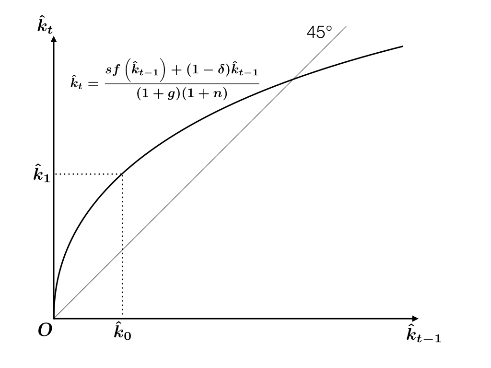
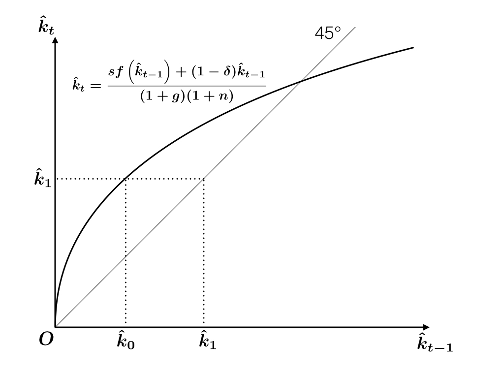
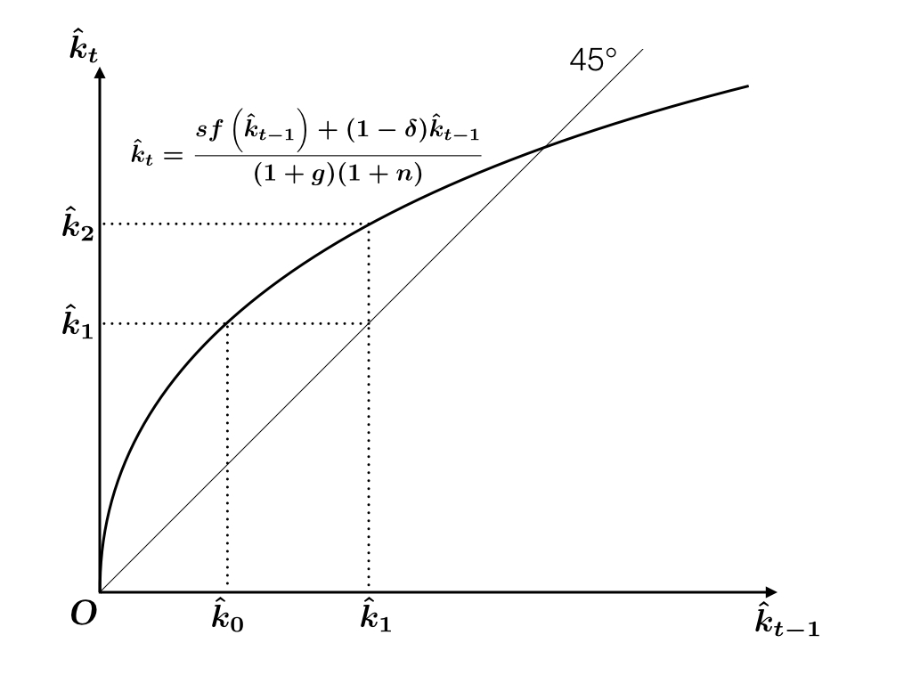
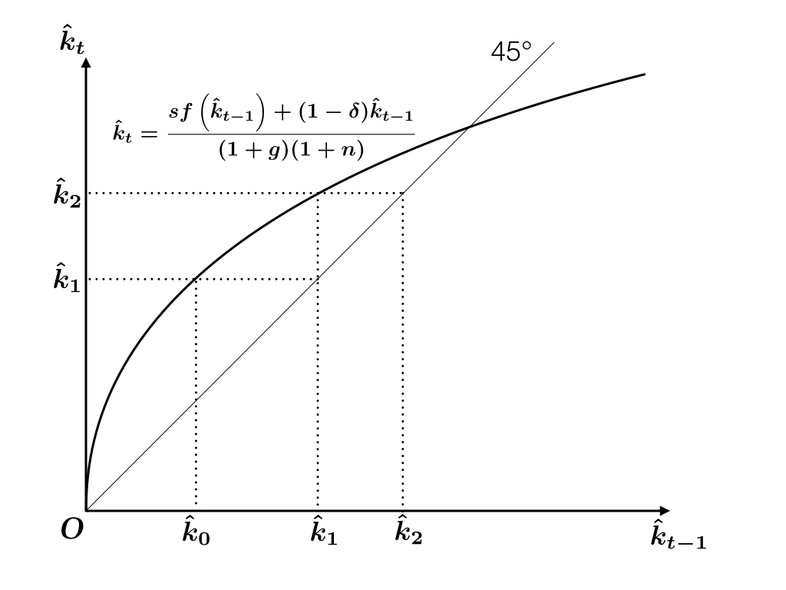
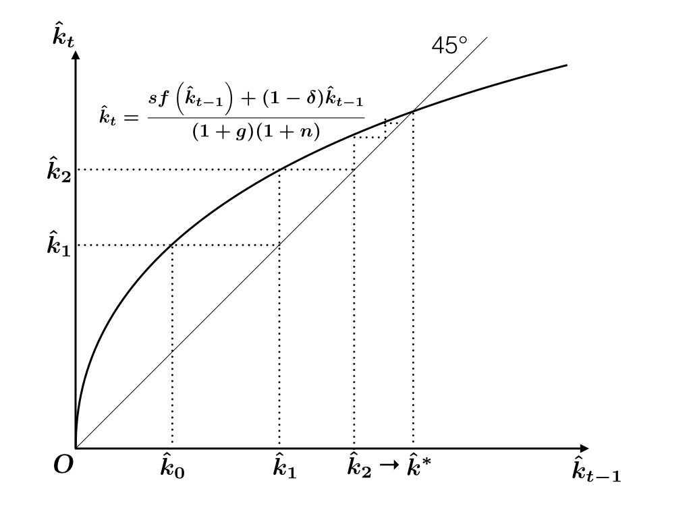

```{r setup, include=FALSE}
knitr::opts_chunk$set(fig.align = 'center')
source("../R/utils.R")
library(tidyverse)
```

<div style="margin-top: -2.5em"></div>

## Continuous-time v. Discrete-time

We have studied continuous-time macroeconomic models. Here is a summary of our modelling strategy: We

1. model economic activities in a very short period of time $[t, t + \Delta t)$
1. derive a system of differential equation(s) by taking $\Delta t \to 0$
1. describe the behavior of the economy diagramatically
1. observe what the economy looks like in transition and in the limit

---

## Continuous-time v. Discrete-time (cont'd)

Continuous-time models are convenient because solutions are often simpler than discrete-time models.

For instance, see growth rate formulas: 

$$\begin{aligned}
  e^{a} e^{b} &= e^{a + b} \\
  (1 + a)(1 + b) &= 1 + a + b + ab
\end{aligned}$$

Also, phase-diagramatic analysis may not work in the discrete-time models.

---

## Continuous-time v. Discrete-time (cont'd)

In spite of the downsides of discrete-time models, many papers use them probably because 

* its interpretation is straightforward;
* time series analysis works better (note that all available data are in discrete time).

Since analysts can choose whichever is convenient, you also need to understand both schemes.

---

`r section("Discrete-time Models")`

---

background-image: url("discrete-time/discrete-time.001.jpeg")

---


background-image: url("discrete-time/discrete-time.002.jpeg")

---

background-image: url("discrete-time/discrete-time.003.jpeg")

---

## Notation and goal

We will use the third choice.

* Time is discrete and extends from $0$ to $\infty$.
* Period between time points $t - 1$ and $t$ is called "Period $t$".
* For stock variables, notation like $K_t$ denotes the end-of-period balance.

We need to find a rule that governs the development of 

$$K_0, K_1, \dots, \quad Y_1, Y_2, \dots$$

etc. Let's first study the discrete-time Solow model.


---

## Exogenous growth

Let's suppose that knowledge $A$ and labor $L$ grow exogenously. In discrete-time models, 
this assumption is expressed as

$$\begin{aligned}
  A_t &= (1 + g) A_{t-1}\\
  L_t &= (1 + n) L_{t-1}, \qquad t = 1, 2, \dots
\end{aligned}$$

---

## Production and investment

The firms produce output, employing what is available at the beginning of the period, or
equivalently, what was available at the end of the previous period.

$$Y_t = F(K_{t-1}, A_{t-1} L_{t-1})$$

$F$ is a CRS production function and $Y$ denotes aggregate production.

We assume a closed free economy with a constant saving rate

$$S_t = I_t = sY_t$$


---

## Capital Accumulation

Net investment $K_{t} - K_{t-1}$ is by definition

$$\begin{aligned}
K_t - K_{t-1} 
  &= I_t - \delta K_{t-1}\\
  &= sY_t - \delta K_{t-1}\\
  &= sF(K_{t-1}, A_{t-1} L_{t-1}) - \delta K_{t-1}
\end{aligned}$$

where $\delta$ is the depreciation rate. By rearranging,

$$K_t = sF(K_{t-1}, A_{t-1} L_{t-1}) + (1 - \delta) K_{t-1}$$


---

## Effective labor

Define

$$\hat k_t = \frac{K_t}{A_t L_t}$$ 

and 

$$\hat{y}_t = f\left( \hat k_t \right) = F\left(\hat{k}_t, 1    \right)$$

---

## Capital accumulation 

Divide by $A_{t-1} L_{t-1}$ both sides of
$$K_t = sF(K_{t-1}, A_{t-1} L_{t-1}) + (1 - \delta) K_{t-1}$$

The left-hand side 

$$\frac{K_t}{A_{t-1} L_{t-1}}
=
\frac{K_t}{A_{t} L_{t}} \frac{A_{t} L_{t}}{A_{t-1} L_{t-1}}
=
\hat{k}_t (1 + g)(1 + n)$$

The right hand side

$$\frac{sF(K_{t-1}, A_{t-1} L_{t-1}) + (1 - \delta) K_{t-1}}{A_{t-1} L_{t-1}}
= sf\left(\hat{k}_{t-1}\right) + (1 - \delta) \hat{k}_{t-1}$$

---

## Capital accumulation

We obtain

$$\hat{k}_t
= \frac{sf\left(\hat{k}_{t-1}\right) + (1 - \delta) \hat{k}_{t-1}}{(1+g)(1+n)}$$

Or

$$\hat{k}_t - \hat{k}_{t-1}
= \frac{sf\left(\hat{k}_{t-1}\right) - (\delta + g + n + gn) \hat{k}_{t-1}}{(1+g)(1+n)}$$


---

## Break-even investment

$$\hat{k}_t > \hat{k}_{t-1} \Leftrightarrow sf\left(\hat{k}_{t-1}\right) > (\delta + g + n + gn) \hat{k}_{t-1}$$

$$\hat{k}_t < \hat{k}_{t-1} \Leftrightarrow sf\left(\hat{k}_{t-1}\right) < (\delta + g + n + gn) \hat{k}_{t-1}$$


Break-even investment in discrete-time model is $(\delta + g + n + gn)\hat{k}$, which is slightly 
larger than the continuous-time counterpart. 

This difference comes from the difference between nominal and effective rates. When $g$ and $n$ are very small,
then we can ignore the difference: 

$$\delta + g + n + gn \simeq \delta + g + n$$

---

## Dynamics

Analysis analogous to continuous-time Solow model may not work since 
we haven't ruled out a scenario that the sign conditions alternate

$$k_{t-1} - k_t < 0, \quad k_t - k_{t+1} >0 , \quad k_{t+1} - k_{t+2} < 0, \dots$$

This doesn't happen in continuous-time models in which stock variables develop continuously.

In discrete-time models, the following "staircase" diagram might work better.

---

## Policy function

```{r, echo=FALSE}

```

---

## Policy function

```{r, echo=FALSE}

```

---

## 45 degree line

```{r, echo=FALSE}

```

---

## $t = 1 \to 2$

```{r, echo=FALSE}

```

---

## 45 degree line

```{r, echo=FALSE}

```


---

## Continue this argument to get convergence

```{r, echo=FALSE}

```


---

## Steady state

We get convergence to the steady state value

$$\hat{k}_t \to \hat{k}^*$$


In the steady state, balanced growth is achieved:

$$K_t = A_t L_t \hat{k}^*$$

$$Y_t = A_t L_t f\left( \hat{k}^* \right)$$


Exercise: Verify the same convergence from $\hat{k}_0 > \hat k^*$.