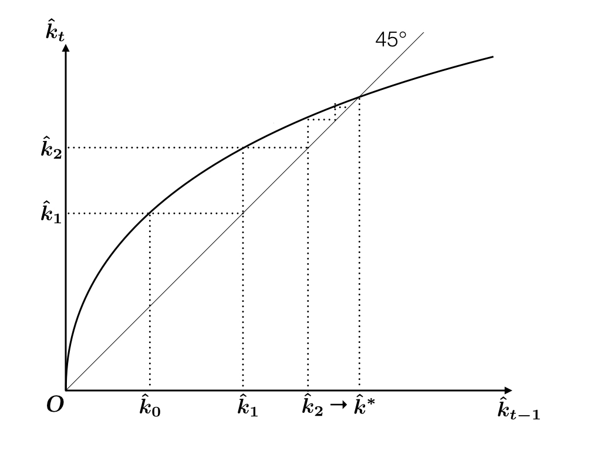

```{r setup, include=FALSE}
knitr::opts_chunk$set(fig.align = 'center')
source("../R/utils.R")
library(tidyverse)
```

<div style="margin-top: -2.5em"></div>

## Discrete-time Ramsey Model

We assume that there is no population growth, i.e., $n = 0$.

Let 

- $b_t =$ Savings at the end of period $t$
- $c_t =$ Consumption in period $t$,
- $r_t =$ Interest rate in period $t$
- $w_t =$ Wage rate in period $t$

The representative consumer supplies one unit of labor. 
He is subject to the following budget contraint: 

$$\begin{aligned}
  \underbrace{b_{t} - b_{t-1}}_{\text{Increment of bank balance}} + 
  \underbrace{c_t}_{\text{Consumption}}
  \le
  \underbrace{w_t}_{\text{Labor Income}}
  +
  \underbrace{r_t b_{t-1}}_{\text{Interest Income}}
\end{aligned}$$

---

## Life-time budget constraint

Rearraging, 

$$\begin{aligned}
  b_1 + c_1 &\le w_1 + (1 + r_1) b_0 \\
  b_2 + c_2 &\le w_2 + (1 + r_2) b_1 \\
            &\vdots \\
  b_{t} + c_t &\le w_t + (1 + r_t) b_{t-1} \\
            &\vdots 
\end{aligned}$$

Multiply both sides of each inequality by 

$$
  R_t = (1 + r_1) \times \cdots \times (1 + r_t)
$$

to get representations in present value.

---

## Lifetime budget constraint

Assuming No-Ponzi Game condition, we obtain

$$\begin{aligned}
  \sum_{t = 1}^\infty R_t^{-1} c_t 
  \le
  b_0 
  +
  \sum_{t = 1}^\infty R_t^{-1} w_t
\end{aligned}$$

* Exercise 1. Write down the NPZ condition.
* Exercise 2. Derive the lifetime budget constraint given above.

---

## Consumer's Optimization

The consumer chooses his consumption plan by maximizing the utility from consumption

$$\begin{aligned}
U = \sum_{t = 1}^\infty \left( \frac{1}{1 + \rho} \right)^{t - 1} u(c_t)
\end{aligned}$$

subject to 

$$\begin{aligned}
  \sum_{t = 1}^\infty R_t^{-1} c_t 
  =
  b_0 
  +
  \sum_{t = 1}^\infty R_t^{-1} w_t
\end{aligned}$$


---

## Optimal Consumption

In optimum, marginal rate of substitution between any pair of periods must be equal to the relative price. In particular,

$$\begin{aligned}
  MRS = - \frac{
    \partial U / \partial c_t
  }{
    \partial U / \partial c_{t+1}
  }
  = -\frac{R_t^{-1}}{R_{t+1}^{-1}}
\end{aligned}$$

We obtain the Euler equation for the discrete-time Ramsey problem:

$$\begin{aligned}
  \frac{u'(c_t)}{u'(c_{t+1})} = 
  \frac{1 + r_{t+1}}{1 + \rho}
\end{aligned}$$

---

## CRRA assumption, Nominal rate representation

When period-wise utility has CRRA, we obtain

$$\begin{aligned}
  \frac{c_{t+1}}{c_t} 
  =
  \left(
    \frac{1 + r_{t+1}}{1 + \rho}
  \right)^{1 / \theta}
\end{aligned}$$

By taking log, we get representation similar to the Euler condition in continuous time.

$$\begin{aligned}
  \underbrace{\ln c_{t+1} - \ln c_t}_{\text{Nominal growth rate}} = 
  \frac{\ln (1+r_{t+1}) - \ln(1+\rho)}{\theta}
\end{aligned}$$

Again, continuous-time models are built with nominal rates, while discrete-time models are built with effective rates. 

---

## Market Clearing 

Using the market clearing condition,

$$\begin{aligned}
  b_{t-1} = k_{t-1},
\end{aligned}$$

we can transform the flow budge constraint

$$\begin{aligned}
  b_t + c_t = w_t + (1 + r_t) b_{t-1}
\end{aligned}$$

into

$$\begin{aligned}
  k_t + c_t = w_t + (1 + r_t) k_{t-1}
\end{aligned}$$

---

## Profit maximization

In competitive factor markets, firms maximize

$$\begin{aligned}
  F(K_{t-1}, A_{t-1} L_{t-1}) - (r_t + \delta) K_{t-1} - w_t L_{t-1},
\end{aligned}$$

The first-order conditions for profit maximization are given by

$$\begin{aligned}
  r_t &= f'\left( \hat{k}_{t-1} \right) - \delta\\
  w_t &= A_{t-1} \left[ 
           f\left( \hat{k}_{t-1} \right) - 
           \hat{k}_{t-1} f'\left( \hat{k}_{t-1} \right)
         \right]
\end{aligned}$$

---

## Capital Accumulation

From 

$$\begin{aligned}
  r_t &= f'\left( \hat{k}_{t-1} \right) - \delta\\
  w_t &= A_{t-1} \left[ 
           f\left( \hat{k}_{t-1} \right) - 
           \hat{k}_{t-1} f'\left( \hat{k}_{t-1} \right)
         \right]
\end{aligned}$$

and

$$\begin{aligned}
  &k_t + c_t = w_t + (1 + r_t) k_{t-1} \\
  &\Rightarrow
  (1 + g) \hat{k}_t + \hat{c}_t = \hat{w}_t + (1 + r_t)\hat{k}_{t-1}
\end{aligned}$$

where $\hat{c}_t = c_t / A_{t-1}$, $\hat{w}_t = w_t / A_{t-1}$, $\hat{k}_t = k_t / A_t$


---

## Dynamic Sytem

We have capital accumulation equation

$$\begin{aligned}
  \left(1+g\right)\hat{k}_{t}
  =
  f\left(\hat{k}_{t-1}\right)-\hat{c}_{t}+
  \left(1-\delta\right)\hat{k}_{t-1}
\end{aligned}$$


and Euler equation

$$\begin{aligned}
  \frac{\hat{c}_{t+1}}{\hat{c}_t} 
  =
  \frac{1}{1 + g}
  \left(
    \frac{1 + f'\left( \hat{k}_t \right) - \delta}{1 + \rho}
  \right)^{1 / \theta}
\end{aligned},$$

which jointly determine the dynamics of the economy.

Initial $c_1$ is determined by the terminal condition $\hat{k}_t \to \hat{k}^*$.

---

## Simplifying Assumption

Assume $\delta = 1$, $g = 0$, $\theta = 1$. The conditions simplify to

$$\begin{aligned}
  \hat{k}_t &= f\left( \hat{k}_{t-1} \right) - \hat{c}_t \\
  \frac{\hat{c}_{t+1}}{\hat{c}_{t}} &= \frac{f'\left( \hat{k}_t \right)}{ 1 + \rho}
\end{aligned}$$

The system is of second order

$$\begin{aligned}
  \hat{k}_{t+1} 
  = 
  f\left( \hat{k}_t \right) - 
  \frac{f'\left( \hat{k}_t \right)}{ 1 + \rho}
  \left[
    f\left( \hat{k}_{t-1} \right) - \hat{k}_{t}
  \right]
\end{aligned}$$

but we only have one initial condition $\hat{k}_0$, which is why we need terminal 
condition to determine the full dynamics.

---

## Optimal Dynamics

Under normal circumstances, we have an increasing policy function $\hat{k}_t \mapsto \hat{k}_{t+1}$. (See Dechert and Nishimura, 1983)

```{r, echo=FALSE, out.height=410}

```


